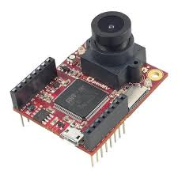

# Lego Brick Sorter Machine

This project is inspired by [Daniel West's project][4] to build a Lego sorter

[Lego Sorter][5]

This YouTube video is a nice explantion of the three steps to build a Lego sorter

#### 1.  [Build a dataset to train the AI][1] using the [Ldraw Library][3] and use [blender][2] to render the image, I have adapted this from J Theiner python script.

#### 2.  Train the AI using Tensorflow using [colab][6] using the cloud GPU to produce the classifier model. 

#### 3.  Build a image capature and classification process using the classifier model using the OpenMV 

System has been build on Raspberrypi Model B but is very slow and the AI has to be executed remotely.

Using the OpenMV it is hoped that the AI deployed onto the local machine.
 
 
 

## Requirements / Installation

##### Blender 2.79 + ImportLDraw
##### colab
##### Tensorflow
##### Python
##### OpenMV

## Thing to Do

##### Improve rendered images with more noise
##### Deploy Tensorflow model to OpenMV

[1]: https://github.com/Gadgeteering/LegoBrickClassification/blob/master/README.md
[2]: https://github.com/TobyLobster/ImportLDraw
[3]: http://www.ldraw.org/
[4]: https://youtu.be/-UGl0ZOCgwQ
[5]: https://towardsdatascience.com/how-i-created-over-100-000-labeled-lego-training-images-ec74191bb4ef
[6]: https://colab.research.google.com/

